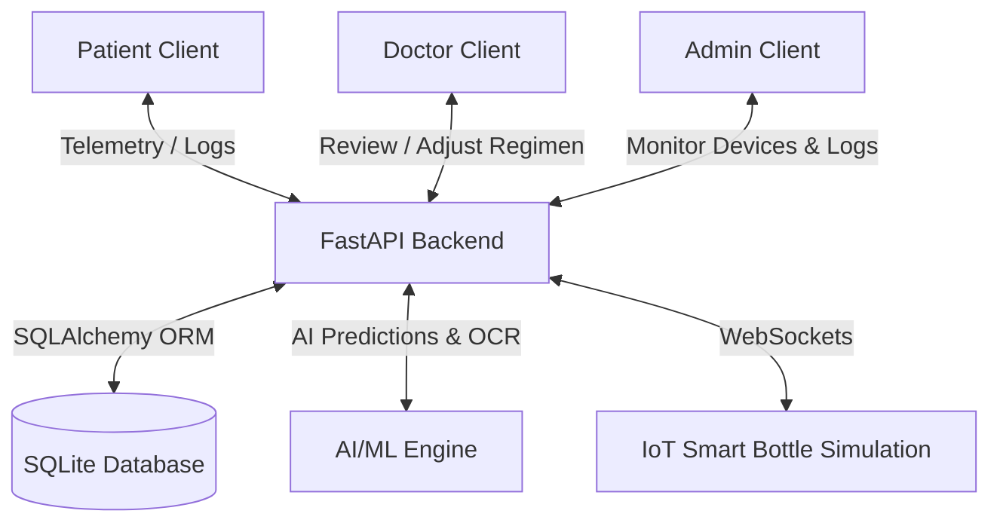

# MediMind AI — Intelligent Medication Adherence System

MediMind AI is an advanced, AI-driven healthcare platform designed to optimize patient medication adherence, bridge the gap in clinical workflows through telemedicine, and provide real-time telemetry from paired Smart Bottles. 

This repository contains the complete codebase, comprising a React + TanStack Router single-page frontend application and a FastAPI + SQLite backend service.

---

## Table of Contents
1. [System Overview & Workflows](#system-overview--workflows)
2. [Architecture](#architecture)
3. [Directory Structure](#directory-structure)
4. [Backend Service Setup](#backend-service-setup)
5. [Frontend Client Setup](#frontend-client-setup)
6. [Key Design Choices](#key-design-choices)

---

## System Overview & Workflows

MediMind AI connects patients, doctors, and administrators through a cohesive, responsive workspace. The primary workflows are:



### 1. Smart Bottle Telemetry Sync
* **Sensor Events:** The Smart Bottle (simulated via WebSockets/API) fires telemetry events (e.g., `open`, `close`, `sync`) along with battery level, weight changes, and ambient temperature.
* **Database & Adherence Update:** The backend logs the event, updates the remaining pill count, and matches the timestamps against the patient's schedule to determine if the dose was taken on time, delayed, or missed.
* **Live Notifications:** Real-time events push alerts directly to the user dashboard.

### 2. AI Chat & Voice Assistant (MediMind Copilot)
* **Interactive Chat:** Patients interact with the floating/full assistant to check schedules, resolve side effect questions, or query logs.
* **Speech Integration:** Integrates browser `webkitSpeechRecognition` for voice-to-text input, and `window.speechSynthesis` for natural audio feedback.

### 3. OCR Prescription Scanning
* **OCR Pipeline:** Users upload a photo of a physical prescription.
* **Entity Extraction:** The system parses key information (medicine name, dosage, frequency, duration, doctor name, hospital) and automatically structures a ready-to-save medication schedule.

### 4. Telemedicine & Telemetry Roster
* **Doctor Workspace:** Doctors monitor an adherence roster of their patients categorized by AI-assessed risk levels (High, Medium, Low).
* **AI Action Recommendations:** If the AI detects deviations (e.g., missed anticoagulant doses), it suggests corrective recommendations (e.g., adjusting schedules or requesting virtual follow-ups) which doctors can apply with a single click.
* **Direct Consultations:** Direct text and simulated video links are managed directly inside the chat interface.

---

## Architecture

### Frontend (React & TypeScript)
* **Vite Dev Server:** Hot-reloads changes instantly.
* **TanStack Router:** File-based routing located under `src/routes/` with path conventions like `_app.tsx` acting as layout wrappers.
* **Role-Based Workspaces:** An in-memory store (`role-store.ts`) manages active roles (Patient, Doctor, Admin) to instantly morph the sidebar navigation, dashboard layouts, and report statistics.
* **Visuals & Charts:** Uses `recharts` for charts (adherence history, battery tracking, risk distribution) and premium dark-mode styling utilizing glassmorphism styles in `src/styles.css`.
* **Proxy-Mock Layer:** Centralized in `src/lib/api.ts`, which returns programmatically generated mock arrays (30-day schedules, telemetry histories, rosters) if the FastAPI backend is offline.

### Backend (FastAPI & SQLAlchemy)
* **Router Routing:** Clean, decoupled modular design (routers located in `app/routers/` for `auth`, `profiles`, `devices`, `medicines`, `notifications`, `telemedicine`, etc.).
* **Data Layer:** SQLite db (`medimind.db`) mapped via SQLAlchemy models (`app/models/`) and validated through Pydantic schemas (`app/schemas/`). Database schema migrations are handled cleanly through Alembic.
* **Cron Jobs & Scheduler:** Powered by `APScheduler` (`app/jobs/scheduler.py`) to process daily summaries, calculate compliance scores, and dispatch alerts.
* **WebSockets Server:** Real-time user connections handled by the WebSocket Connection Manager (`app/websocket/manager.py`).

---

## Directory Structure

```
medimind-ai/
├── backend/                       # Python FastAPI Backend
│   ├── app/
│   │   ├── ai/                    # ML / Prediction algorithms & OCR scan interfaces
│   │   ├── core/                  # Database connections, App Settings, and exceptions
│   │   ├── jobs/                  # Cron jobs & background adherence aggregators
│   │   ├── models/                # SQLAlchemy database models
│   │   ├── routers/               # FastAPI controllers / endpoints
│   │   ├── schemas/               # Pydantic input / output validation types
│   │   ├── services/              # Pure business logic services
│   │   └── websocket/             # WebSocket connection manager
│   ├── alembic/                   # Database migrations
│   ├── main.py                    # App entry point
│   ├── requirements.txt           # Python backend dependencies
│   └── medimind.db                # SQLite database file
├── src/                           # React + TypeScript Frontend
│   ├── components/                # Modular layout components (sidebar, navigation, chat)
│   ├── hooks/                     # Custom hooks (adherence logic, calendar layout generators)
│   ├── lib/                       # API Proxy layer, mock assets, error tracking utils
│   ├── routes/                    # TanStack Router files (file-based navigation)
│   ├── styles.css                 # Custom premium styling, glassmorphism utilities
│   └── routeTree.gen.ts           # Auto-generated routing mapping
├── package.json                   # Frontend dependencies & configurations
└── vite.config.ts                 # Vite setup
```

---

## Backend Service Setup

To run the FastAPI server locally:

1. Navigate to the backend directory:
   ```bash
   cd backend
   ```
2. Create and activate a Python virtual environment:
   ```bash
   python -m venv venv
   # On Windows:
   .\venv\Scripts\activate
   # On Unix:
   source venv/bin/activate
   ```
3. Install dependencies:
   ```bash
   pip install -r requirements.txt
   ```
4. Copy env variables and set up database:
   ```bash
   cp .env.example .env
   # Run migrations (or SQLite db will auto-generate)
   alembic upgrade head
   ```
5. Run the FastAPI development server:
   ```bash
   uvicorn main:app --reload --port 8000
   ```

---

## Frontend Client Setup

To run the React development server locally:

1. Install npm dependencies in the root directory:
   ```bash
   npm install
   ```
2. Start the Vite server:
   ```bash
   npm run dev
   ```
3. Open the browser to the address shown in the output (typically `http://localhost:5173`).

---

## Key Design Choices

* **Offline-Resilient Client States:** In healthcare dashboards, loading delays lead to poor user experiences. We pre-seed React component state with the corresponding mock data array from `src/lib/api.ts` directly. When API requests finish (or fail if the backend is down), the client state updates cleanly with no visual empty-state flickers.
* **Voice Coexistence:** Uses clean string cleaning before sending text payloads to the speech synthesizer. Voice and text chats work in unison.
* **Unified Mock Data Pool:** All mocked values share consistent constants, meaning adding a medicine in the medication panel will reflect properly in the refill metrics and smart bottle weight statistics.
